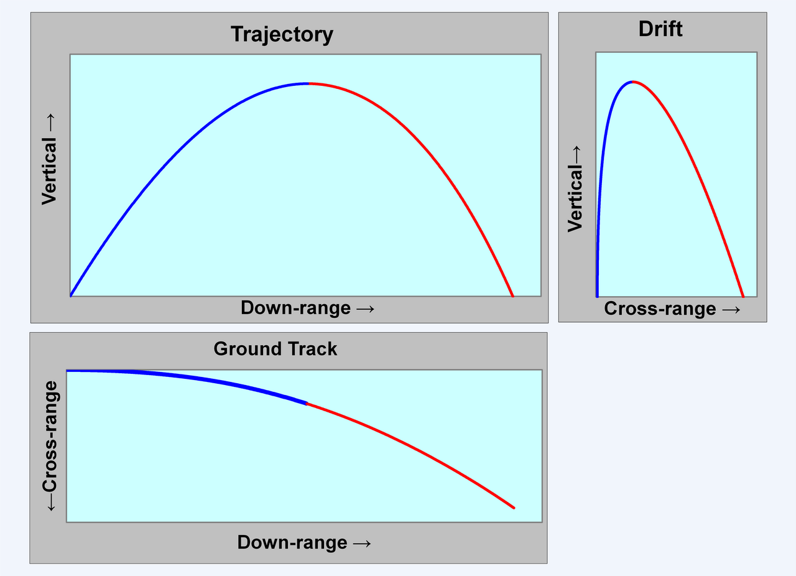

# Lorentz Force Simulation: Visualizing Charged Particle Motion

---

## Introduction

### Key Concept:
The Lorentz force governs charged particle motion in electromagnetic fields:
$$\mathbf{F} = q\mathbf{E} + q\mathbf{v} \times \mathbf{B}$$

### Applications:
- Particle accelerators
- Mass spectrometers
- Plasma confinement devices
- Astrophysical phenomena

---

## Simulation Approach

### Numerical Methods:
- **Runge-Kutta 4th order** for accurate trajectory calculation
- Time-step integration of equations of motion:
  $$\frac{d\mathbf{v}}{dt} = \frac{q}{m}(\mathbf{E} + \mathbf{v} \times \mathbf{B})$$
  $$\frac{d\mathbf{r}}{dt} = \mathbf{v}$$

### Field Configurations:
1. Uniform magnetic field (helical motion)
2. Crossed E and B fields (drift motion)
3. Combined fields (complex trajectories)

---

## Python Implementation

```python
import numpy as np
import matplotlib.pyplot as plt
from mpl_toolkits.mplot3d import Axes3D

# Constants
q = 1.6e-19  # Particle charge (C)
m = 9.1e-31  # Particle mass (kg)

def lorentz_force(r, v, t, E, B):
    return q*(E + np.cross(v, B))/m

def runge_kutta_4(r0, v0, t, E, B):
    trajectory = np.zeros((len(t), 3))
    r, v = r0.copy(), v0.copy()
    for i in range(len(t)):
        k1v = lorentz_force(r, v, t[i], E, B)
        k1r = v
        k2v = lorentz_force(r + 0.5*k1r*dt, v + 0.5*k1v*dt, t[i]+0.5*dt, E, B)
        k2r = v + 0.5*k1v*dt
        k3v = lorentz_force(r + 0.5*k2r*dt, v + 0.5*k2v*dt, t[i]+0.5*dt, E, B)
        k3r = v + 0.5*k2v*dt
        k4v = lorentz_force(r + k3r*dt, v + k3v*dt, t[i]+dt, E, B)
        k4r = v + k3v*dt
        
        v += (k1v + 2*k2v + 2*k3v + k4v)*dt/6
        r += (k1r + 2*k2r + 2*k3r + k4r)*dt/6
        trajectory[i] = r
    return trajectory
```

---

## Visualization Gallery

### Case 1: Uniform Magnetic Field (B = 1Tẑ)


**Circular motion** in xy-plane with **constant drift** along z-axis

### Case 2: Crossed Fields (E = 1kV/mŷ, B = 1Tẑ)

**Curved trajectory** showing **E×B drift** phenomenon

### Case 3: Combined Fields (E = B = 1 units)
 
**Spiral motion** with **varying radius**

---

## Key Parameters

| Parameter | Effect on Trajectory | Typical Value |
|-----------|----------------------|---------------|
| q/m ratio | Determines curvature | 1.76×10¹¹ C/kg |
| E field | Causes acceleration | 1-1000 kV/m |
| B field | Induces rotation | 0.1-10 T |
| v₀ | Initial conditions | 10³-10⁷ m/s |

---

## Practical Applications

1. **Cyclotrons**:
   - Particles spiral outward with increasing energy
   - RF fields synchronized with orbital frequency

2. **Mass Spectrometers**:
   - Different q/m ratios yield distinct paths
   - Enables precise mass measurements

3. **Magnetic Confinement**:
   - Plasma particles follow field lines
   - Tokamak designs for fusion reactors

---

## Extensions

1. **Non-uniform fields**:
   - Gradient-B drift effects
   - Magnetic mirror configurations

2. **Relativistic effects**:
   - Significant at v > 0.1c
   - Mass increase alters trajectories

3. **Multi-particle systems**:
   - Space charge effects
   - Particle-particle interactions

---

## Conclusion

- Lorentz force simulations reveal **complex 3D trajectories**
- Field configurations produce **distinct motion patterns**
- Applications span **accelerators to astrophysics**
- Python provides **effective visualization tools**

