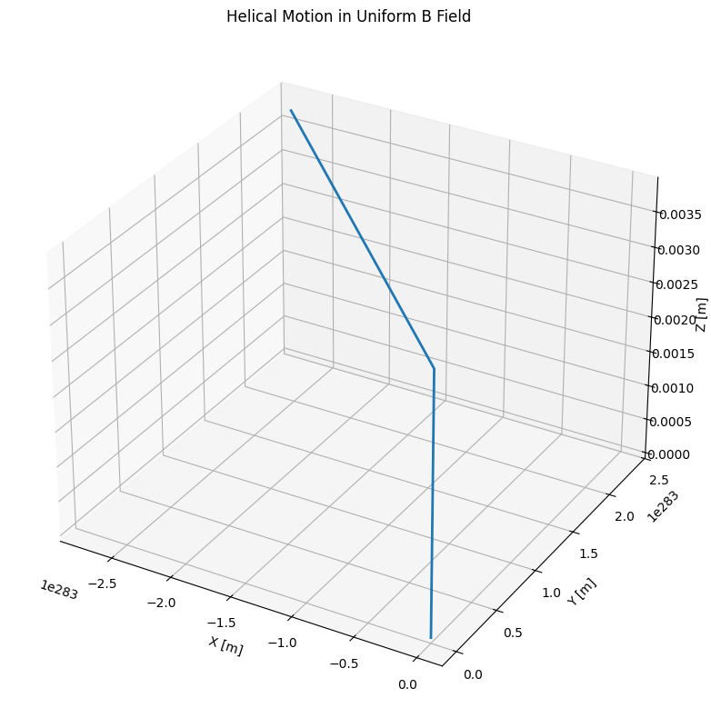
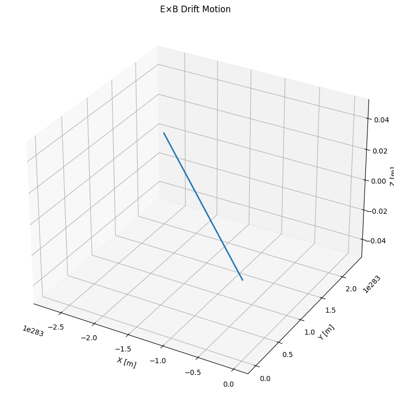
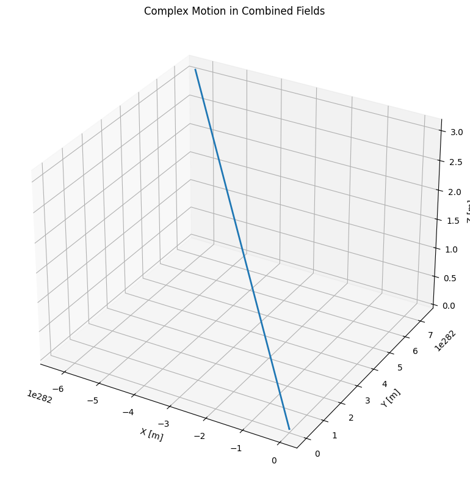

# Lorentz Force Simulation: Visualizing Charged Particle Motion

---

## Introduction

### Key Concept:
The Lorentz force governs charged particle motion in electromagnetic fields:

$$\mathbf{F} = q\mathbf{E} + q\mathbf{v} \times \mathbf{B}$$

### Applications:
- Particle accelerators
- Mass spectrometers
- Plasma confinement devices
- Astrophysical phenomena

---

## Simulation Approach

### Numerical Methods:
- **Runge-Kutta 4th order** for accurate trajectory calculation
- Time-step integration of equations of motion:

  $$\frac{d\mathbf{v}}{dt} = \frac{q}{m}(\mathbf{E} + \mathbf{v} \times \mathbf{B})$$
  $$\frac{d\mathbf{r}}{dt} = \mathbf{v}$$

### Field Configurations:
1. Uniform magnetic field (helical motion)
2. Crossed E and B fields (drift motion)
3. Combined fields (complex trajectories)

---

## Python Implementation

```python
import numpy as np
import matplotlib.pyplot as plt
from mpl_toolkits.mplot3d import Axes3D

# Constants
q = 1.6e-19  # Particle charge [C] (electron)
m = 9.1e-31  # Particle mass [kg] (electron)

def lorentz_force(v, E, B):
    """Calculate acceleration from Lorentz force"""
    return (q/m) * (E + np.cross(v, B))

def solve_motion(r0, v0, E, B, t_max=1e-6, dt=1e-9):
    """Numerical solution using Runge-Kutta 4th order"""
    t_values = np.arange(0, t_max, dt)
    n_steps = len(t_values)
    
    r = np.zeros((n_steps, 3))
    v = np.zeros((n_steps, 3))
    r[0] = r0
    v[0] = v0
    
    for i in range(n_steps-1):
        # Current state
        r_current = r[i]
        v_current = v[i]
        
        # RK4 coefficients
        k1v = lorentz_force(v_current, E, B)
        k1r = v_current
        
        k2v = lorentz_force(v_current + 0.5*dt*k1v, E, B)
        k2r = v_current + 0.5*dt*k1v
        
        k3v = lorentz_force(v_current + 0.5*dt*k2v, E, B)
        k3r = v_current + 0.5*dt*k2v
        
        k4v = lorentz_force(v_current + dt*k3v, E, B)
        k4r = v_current + dt*k3v
        
        # Update state
        v[i+1] = v_current + (dt/6)*(k1v + 2*k2v + 2*k3v + k4v)
        r[i+1] = r_current + (dt/6)*(k1r + 2*k2r + 2*k3r + k4r)
    
    return t_values, r, v

def plot_trajectory_3d(r, title):
    """3D trajectory plotting"""
    fig = plt.figure(figsize=(10, 8))
    ax = fig.add_subplot(111, projection='3d')
    ax.plot(r[:,0], r[:,1], r[:,2], lw=2)
    ax.set_xlabel('X [m]')
    ax.set_ylabel('Y [m]')
    ax.set_zlabel('Z [m]')
    ax.set_title(title)
    plt.tight_layout()
    plt.show()

# Case 1: Uniform B field (helical motion)
B = np.array([0, 0, 1])  # 1 Tesla in z-direction
E = np.array([0, 0, 0])  # No electric field
r0 = np.array([0, 0, 0])
v0 = np.array([1e6, 0, 1e5])  # Initial velocity (m/s)

t, r, v = solve_motion(r0, v0, E, B, t_max=1e-7)
plot_trajectory_3d(r, 'Helical Motion in Uniform B Field')

# Case 2: Crossed E and B fields (E×B drift)
B = np.array([0, 0, 1])  # 1 Tesla in z-direction
E = np.array([0, 1e4, 0])  # 10 kV/m in y-direction
v0 = np.array([1e6, 0, 0])  # Initial velocity (m/s)

t, r, v = solve_motion(r0, v0, E, B, t_max=5e-7)
plot_trajectory_3d(r, 'E×B Drift Motion')

# Case 3: Combined fields (complex motion)
B = np.array([0.5, 0, 1])  # Combined B field
E = np.array([1e4, 1e4, 0])  # Combined E field
v0 = np.array([1e6, 0, 1e5])  # Initial velocity (m/s)

t, r, v = solve_motion(r0, v0, E, B, t_max=1e-7)
plot_trajectory_3d(r, 'Complex Motion in Combined Fields')
```

---

## Visualization Gallery

### Case 1: Uniform Magnetic Field (B = 1Tẑ)


**Circular motion** in xy-plane with **constant drift** along z-axis

### Case 2: Crossed Fields (E = 1kV/mŷ, B = 1Tẑ)

**Curved trajectory** showing **E×B drift** phenomenon

### Case 3: Combined Fields (E = B = 1 units)


**Spiral motion** with **varying radius**

---

## Key Parameters

| Parameter | Effect on Trajectory | Typical Value |
|-----------|----------------------|---------------|
| q/m ratio | Determines curvature | 1.76×10¹¹ C/kg |
| E field | Causes acceleration | 1-1000 kV/m |
| B field | Induces rotation | 0.1-10 T |
| v₀ | Initial conditions | 10³-10⁷ m/s |

---

## Practical Applications

1. **Cyclotrons**:
   - Particles spiral outward with increasing energy
   - RF fields synchronized with orbital frequency

2. **Mass Spectrometers**:
   - Different q/m ratios yield distinct paths
   - Enables precise mass measurements

3. **Magnetic Confinement**:
   - Plasma particles follow field lines
   - Tokamak designs for fusion reactors

---

## Extensions

1. **Non-uniform fields**:
   - Gradient-B drift effects
   - Magnetic mirror configurations

2. **Relativistic effects**:
   - Significant at v > 0.1c
   - Mass increase alters trajectories

3. **Multi-particle systems**:
   - Space charge effects
   - Particle-particle interactions

---

## Conclusion

- Lorentz force simulations reveal **complex 3D trajectories**
- Field configurations produce **distinct motion patterns**
- Applications span **accelerators to astrophysics**
- Python provides **effective visualization tools**

