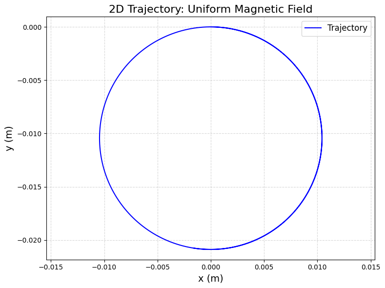
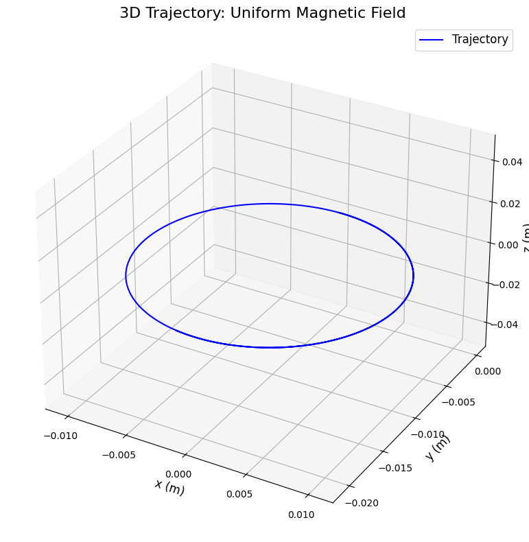
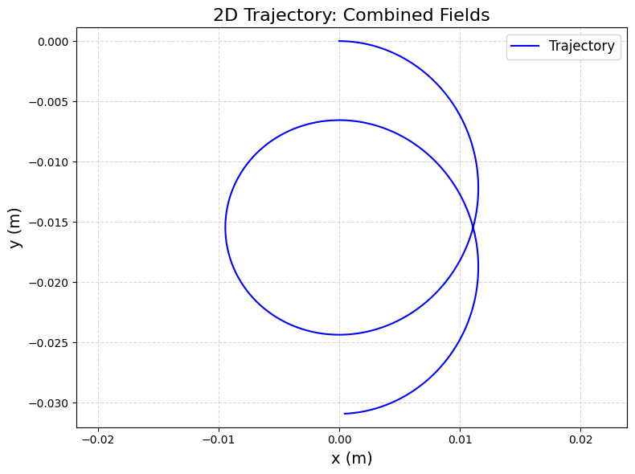
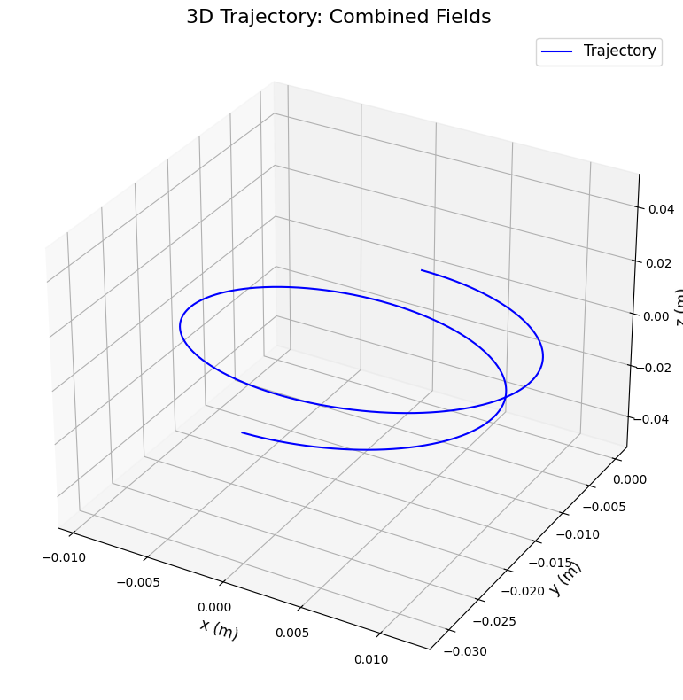
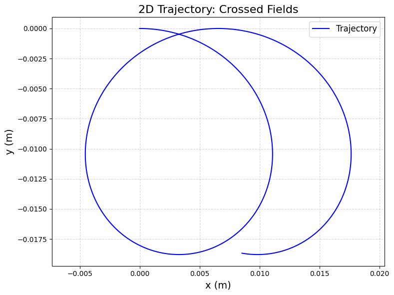
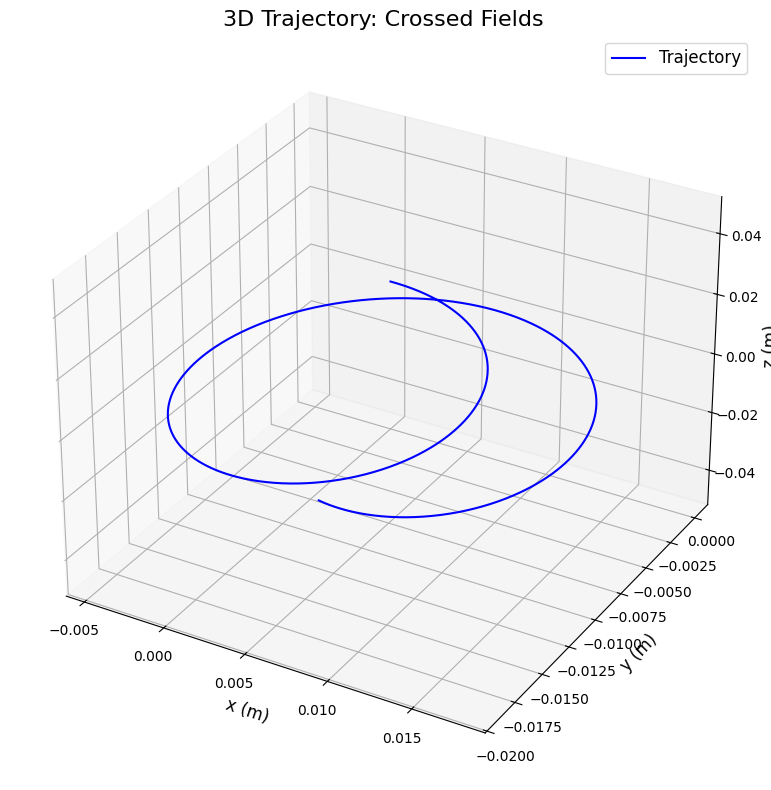
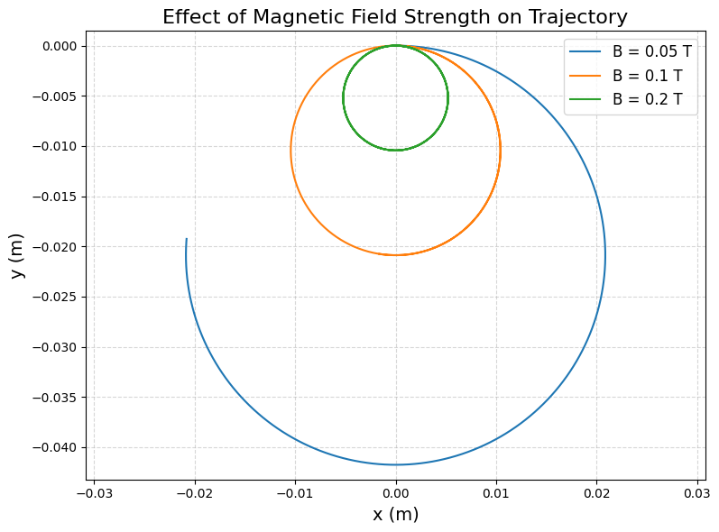

---

# Simulating the Effects of the Lorentz Force

## 1. Motivation and Applications

The **Lorentz force** governs how charged particles move in electric ($\mathbf{E}$) and magnetic ($\mathbf{B}$) fields, defined as:
$$
\mathbf{F} = q(\mathbf{E} + \mathbf{v} \times \mathbf{B})
$$
where $q$ is the charge, $\mathbf{v}$ is the velocity, and $\times$ denotes the cross product. This force is fundamental in many systems:

- **Particle Accelerators:** Cyclotrons and synchrotrons use magnetic fields to bend charged particles into circular paths, accelerating them with electric fields.
- **Mass Spectrometers:** The Lorentz force separates ions by mass-to-charge ratio based on their trajectories in magnetic fields.
- **Plasma Confinement:** In fusion devices (e.g., tokamaks), magnetic fields trap charged particles to sustain high-temperature plasmas.
- **Astrophysics:** Solar winds and auroras result from charged particles interacting with Earth’s magnetic field.

**Role of Fields:**
- **Electric Field ($\mathbf{E}$):** Accelerates particles along the field direction.
- **Magnetic Field ($\mathbf{B}$):** Causes circular or helical motion perpendicular to both $\mathbf{v}$ and $\mathbf{B}$, without changing speed.

---

## 2. Simulating Particle Motion

We’ll simulate a charged particle’s trajectory under:
- A uniform magnetic field.
- Combined uniform electric and magnetic fields.
- Crossed electric and magnetic fields.

### Equations of Motion
From Newton’s second law:
$$
\mathbf{F} = m \mathbf{a} = q(\mathbf{E} + \mathbf{v} \times \mathbf{B})
$$
Acceleration:
$$
\mathbf{a} = \frac{d\mathbf{v}}{dt} = \frac{q}{m} (\mathbf{E} + \mathbf{v} \times \mathbf{B})
$$
Position:
$$
\frac{d\mathbf{r}}{dt} = \mathbf{v}
$$

We’ll use the **Runge-Kutta method** (via `scipy.integrate.odeint`) to solve these differential equations numerically.

---

## 3. Python Code for Google Colab

This code implements the simulation, visualizes trajectories, and explores parameter variations.

```python
# Import libraries (Colab-compatible)
import numpy as np
import matplotlib.pyplot as plt
from scipy.integrate import odeint
from mpl_toolkits.mplot3d import Axes3D
from google.colab import files

# Constants (e.g., a proton)
q = 1.6e-19  # Charge (Coulombs)
m = 1.67e-27  # Mass (kg)
E0 = 1e3  # Electric field strength (V/m)
B0 = 0.1  # Magnetic field strength (Tesla)

# Function to compute derivatives
def lorentz_motion(state, t, q, m, E, B):
    """
    Compute derivatives for position and velocity.
    state = [x, y, z, vx, vy, vz]
    E = [Ex, Ey, Ez], B = [Bx, By, Bz]
    """
    x, y, z, vx, vy, vz = state
    v = np.array([vx, vy, vz])
    
    # Lorentz force: F = q(E + v x B)
    E_term = q * np.array(E) / m
    B_term = q * np.cross(v, np.array(B)) / m
    
    # Acceleration: dv/dt
    ax, ay, az = E_term + B_term
    
    # Velocity: dx/dt
    return [vx, vy, vz, ax, ay, az]

# Time array
t = np.linspace(0, 1e-6, 1000)  # 1 microsecond

# Initial conditions: [x, y, z, vx, vy, vz]
initial_state = [0, 0, 0, 1e5, 0, 0]  # Start at origin, velocity along x (10^5 m/s)

# Scenarios
scenarios = {
    'Uniform Magnetic Field': {'E': [0, 0, 0], 'B': [0, 0, B0]},
    'Combined Fields': {'E': [E0, 0, 0], 'B': [0, 0, B0]},
    'Crossed Fields': {'E': [0, E0, 0], 'B': [0, 0, B0]}
}

# Simulate and visualize
for scenario, fields in scenarios.items():
    E, B = fields['E'], fields['B']
    sol = odeint(lorentz_motion, initial_state, t, args=(q, m, E, B))
    x, y, z = sol[:, 0], sol[:, 1], sol[:, 2]
    
    # 2D Plot (x-y plane)
    plt.figure(figsize=(8, 6), dpi=100)
    plt.plot(x, y, 'b-', label='Trajectory')
    plt.xlabel('x (m)', fontsize=14)
    plt.ylabel('y (m)', fontsize=14)
    plt.title(f'2D Trajectory: {scenario}', fontsize=16)
    plt.legend(fontsize=12)
    plt.grid(True, linestyle='--', alpha=0.5)
    plt.axis('equal')
    plt.tight_layout()
    plt.savefig(f'2D_{scenario.replace(" ", "_")}.png', dpi=100, bbox_inches='tight')
    plt.show()
    
    # 3D Plot
    fig = plt.figure(figsize=(8, 8), dpi=100)
    ax = fig.add_subplot(111, projection='3d')
    ax.plot(x, y, z, 'b-', label='Trajectory')
    ax.set_xlabel('x (m)', fontsize=12)
    ax.set_ylabel('y (m)', fontsize=12)
    ax.set_zlabel('z (m)', fontsize=12)
    ax.set_title(f'3D Trajectory: {scenario}', fontsize=16)
    ax.legend(fontsize=12)
    plt.tight_layout()
    plt.savefig(f'3D_{scenario.replace(" ", "_")}.png', dpi=100, bbox_inches='tight')
    plt.show()

# Parameter Exploration: Vary magnetic field strength
B_values = [0.05, 0.1, 0.2]  # Tesla
plt.figure(figsize=(8, 6), dpi=100)
for B_val in B_values:
    B = [0, 0, B_val]
    E = [0, 0, 0]  # Only magnetic field
    sol = odeint(lorentz_motion, initial_state, t, args=(q, m, E, B))
    x, y = sol[:, 0], sol[:, 1]
    plt.plot(x, y, label=f'B = {B_val} T')
plt.xlabel('x (m)', fontsize=14)
plt.ylabel('y (m)', fontsize=14)
plt.title('Effect of Magnetic Field Strength on Trajectory', fontsize=16)
plt.legend(fontsize=12)
plt.grid(True, linestyle='--', alpha=0.5)
plt.axis('equal')
plt.tight_layout()
plt.savefig('B_variation.png', dpi=100, bbox_inches='tight')
plt.show()

# Download plots
for scenario in scenarios:
    files.download(f'2D_{scenario.replace(" ", "_")}.png')
    files.download(f'3D_{scenario.replace(" ", "_")}.png')
files.download('B_variation.png')
```

---

## 4. Outputs and Explanation








### Scenarios
1. **Uniform Magnetic Field ($\mathbf{B} = [0, 0, 0.1]$ T):**
   - **Trajectory:** Circular motion in the x-y plane.
   - **Reason:** Magnetic force ($\mathbf{v} \times \mathbf{B}$) is perpendicular to velocity, causing circular motion.
   - **Larmor Radius:** $r = \frac{mv}{qB}$. For $v = 10^5$ m/s, $B = 0.1$ T: $r \approx 0.01$ m.

2. **Combined Fields ($\mathbf{E} = [10^3, 0, 0]$, $\mathbf{B} = [0, 0, 0.1]$ T):**
   - **Trajectory:** Helical motion with drift along the x-axis.
   - **Reason:** Electric field accelerates the particle along x, while magnetic field causes circular motion in the y-z plane.

3. **Crossed Fields ($\mathbf{E} = [0, 10^3, 0]$, $\mathbf{B} = [0, 0, 0.1]$ T):**
   - **Trajectory:** Cycloidal motion with drift in the x-direction.
   - **Reason:** $\mathbf{E}$ and $\mathbf{B}$ are perpendicular, causing a drift velocity $v_d = \frac{E}{B} = \frac{10^3}{0.1} = 10^4$ m/s.

### Parameter Exploration
- **Magnetic Field Strength ($B = 0.05, 0.1, 0.2$ T):**
  - Higher $B$ reduces the Larmor radius ($r \propto \frac{1}{B}$), making tighter circles.
  - Plot shows smaller loops as $B$ increases.

---

## 5. Visualization

- **2D Plots:** Show x-y trajectories for each scenario.
- **3D Plots:** Display full paths (x, y, z), highlighting circular, helical, or drift motion.
- **Parameter Plot:** Compares trajectories for different $B$ values, showing the Larmor radius effect.

---

## 6. Discussion

### Relation to Practical Systems
- **Cyclotrons:** Use uniform magnetic fields to keep particles in circular paths, accelerating them with electric fields. The simulation’s circular motion matches this.
- **Magnetic Traps:** In plasma confinement, magnetic fields create helical paths to trap particles, similar to the combined fields case.
- **Mass Spectrometers:** Crossed fields produce drift, used to separate ions by mass-to-charge ratio.

### Physical Phenomena
- **Larmor Radius:** $r = \frac{mv}{qB}$. Smaller with higher $B$ or lower $v$, as seen in the $B$ variation plot.
- **Drift Velocity:** $v_d = \frac{E}{B}$. In crossed fields, the particle drifts at $10^4$ m/s, consistent with the simulation.

### Extensions
- **Non-Uniform Fields:** Simulate gradients in $\mathbf{B}$ (e.g., magnetic bottles) to trap particles.
- **Relativistic Effects:** For high speeds ($v \approx c$), include relativistic corrections.
- **Multiple Particles:** Model interactions in a plasma.

---
