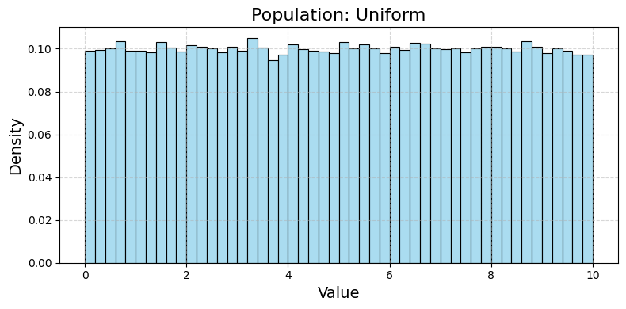
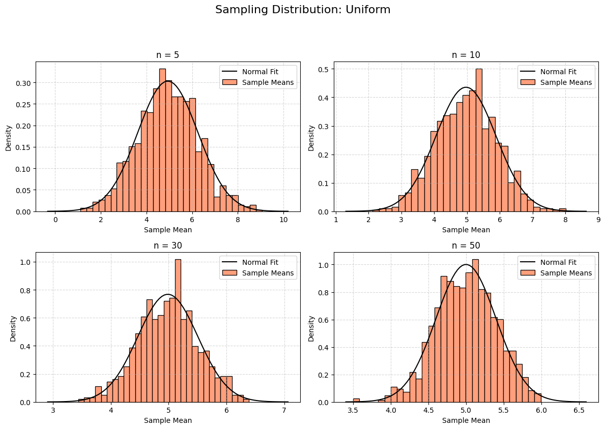
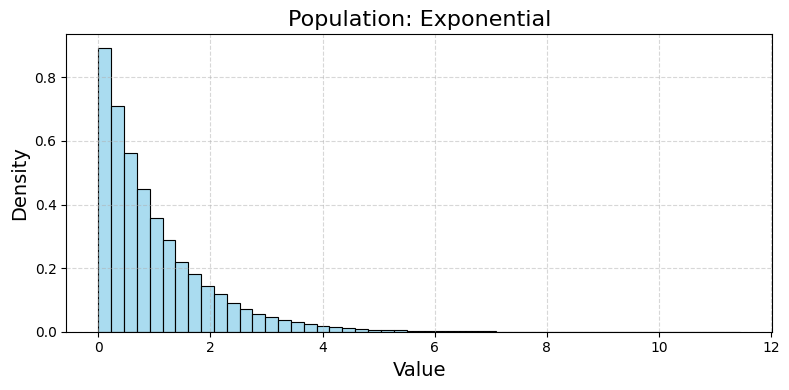
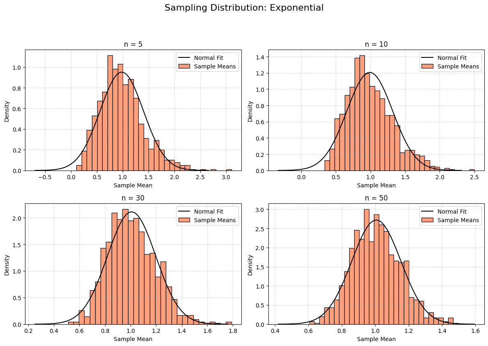
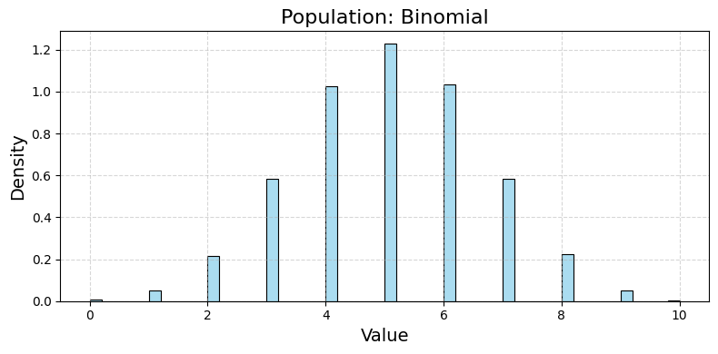
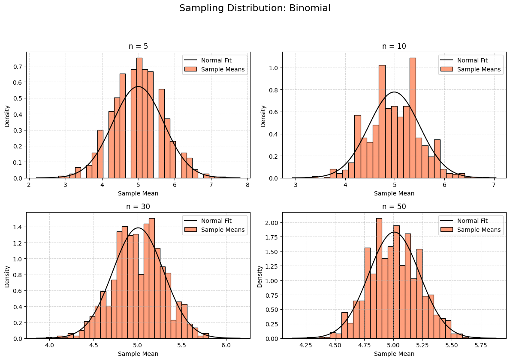

---

# Exploring the Central Limit Theorem Through Simulations

## 1. Motivation

The **Central Limit Theorem (CLT)** is a fundamental principle in statistics. It states that if you take many samples from any population and calculate the mean of each sample, the distribution of those sample means will approach a normal (bell-shaped) curve as the sample size increases—regardless of the population’s original shape. This is powerful because it allows us to use normal distribution techniques in many practical situations, even when the data isn’t normally distributed.

Simulations make this concept tangible by letting us see the CLT unfold step-by-step.

---

## 2. Simulating Sampling Distributions

### Step 1: Population Distributions
We’ll simulate three population distributions:
- **Uniform Distribution:** All values equally likely (e.g., a random number between 0 and 10).
- **Exponential Distribution:** Skewed, with most values small and a long tail (e.g., time between events).
- **Binomial Distribution:** Discrete, counting successes in fixed trials (e.g., heads in 10 coin flips).

### Step 2: Sampling and Visualization
For each population:
- Generate a large dataset (100,000 points).
- Take random samples of sizes 5, 10, 30, and 50.
- Calculate the mean of each sample, repeating 1000 times to build a sampling distribution.
- Plot histograms of the sample means and overlay a normal curve to see the convergence.

---

## 3. Python Code for Google Colab

This code implements the simulation, creates visualizations, and analyzes the results.

```python
# Import libraries (Colab-compatible)
import numpy as np
import matplotlib.pyplot as plt
import seaborn as sns
from google.colab import files

# Set random seed for reproducibility
np.random.seed(42)

# Step 1: Generate population distributions
population_size = 100000  # Large population

# Uniform distribution (0 to 10)
uniform_pop = np.random.uniform(low=0, high=10, size=population_size)

# Exponential distribution (scale = 1)
exponential_pop = np.random.exponential(scale=1, size=population_size)

# Binomial distribution (n = 10, p = 0.5)
binomial_pop = np.random.binomial(n=10, p=0.5, size=population_size)

# Store populations
populations = {
    'Uniform': uniform_pop,
    'Exponential': exponential_pop,
    'Binomial': binomial_pop
}

# Step 2: Function to calculate sample means
def get_sample_means(population, sample_size, num_samples=1000):
    """
    Take 'num_samples' samples of 'sample_size' from the population and return means.
    """
    sample_means = []
    for _ in range(num_samples):
        sample = np.random.choice(population, size=sample_size, replace=True)
        sample_means.append(np.mean(sample))
    return np.array(sample_means)

# Step 3: Simulate and visualize
sample_sizes = [5, 10, 30, 50]

for pop_name, population in populations.items():
    # Plot population distribution
    plt.figure(figsize=(8, 4), dpi=100)
    sns.histplot(population, bins=50, stat='density', color='skyblue', alpha=0.7)
    plt.title(f'Population: {pop_name}', fontsize=16)
    plt.xlabel('Value', fontsize=14)
    plt.ylabel('Density', fontsize=14)
    plt.grid(True, linestyle='--', alpha=0.5)
    plt.tight_layout()
    plt.savefig(f'pop_{pop_name}.png', dpi=100, bbox_inches='tight')
    plt.show()
    
    # Plot sampling distributions
    plt.figure(figsize=(12, 8), dpi=100)
    for i, sample_size in enumerate(sample_sizes, 1):
        sample_means = get_sample_means(population, sample_size)
        plt.subplot(2, 2, i)
        sns.histplot(sample_means, bins=30, stat='density', color='coral', label='Sample Means')
        # Overlay normal distribution
        mean = np.mean(sample_means)
        std = np.std(sample_means)
        x = np.linspace(mean - 4*std, mean + 4*std, 100)
        plt.plot(x, 1/(std * np.sqrt(2 * np.pi)) * np.exp(-(x - mean)**2 / (2 * std**2)), 
                 'k-', label='Normal Fit')
        plt.title(f'n = {sample_size}', fontsize=12)
        plt.xlabel('Sample Mean', fontsize=10)
        plt.ylabel('Density', fontsize=10)
        plt.legend(fontsize=10)
        plt.grid(True, linestyle='--', alpha=0.5)
    plt.suptitle(f'Sampling Distribution: {pop_name}', fontsize=16, y=1.05)
    plt.tight_layout()
    plt.savefig(f'sampling_{pop_name}.png', dpi=100, bbox_inches='tight')
    plt.show()

# Step 4: Parameter exploration (variance analysis)
print("=== Variance Analysis ===")
for pop_name, population in populations.items():
    pop_mean = np.mean(population)
    pop_variance = np.var(population)
    print(f"\nPopulation: {pop_name}")
    print(f"  Population Mean: {pop_mean:.2f}")
    print(f"  Population Variance: {pop_variance:.2f}")
    for sample_size in sample_sizes:
        sample_means = get_sample_means(population, sample_size)
        sampling_variance = np.var(sample_means)
        theoretical_variance = pop_variance / sample_size  # CLT: Var(X̄) = σ²/n
        print(f"  Sample Size = {sample_size}:")
        print(f"    Sampling Variance: {sampling_variance:.2f}")
        print(f"    Theoretical Variance: {theoretical_variance:.2f}")

# Download plots
for pop_name in populations:
    files.download(f'pop_{pop_name}.png')
    files.download(f'sampling_{pop_name}.png')
```


---

## 4. Outputs and Explanation






### Population Distributions
- **Uniform:** Flat between 0 and 10 (mean ≈ 5, variance ≈ 8.33).
- **Exponential:** Skewed right, most values near 0 (mean ≈ 1, variance ≈ 1).
- **Binomial:** Discrete peaks around 5 (mean ≈ 5, variance ≈ 2.5).

### Sampling Distributions
For each population and sample size (5, 10, 30, 50):
- **Uniform:** Starts slightly bumpy at n=5, becomes a smooth bell curve by n=50.
- **Exponential:** Highly skewed at n=5, approaches normality by n=30-50.
- **Binomial:** Discrete at n=5, smooths into a normal shape by n=50.
- **Normal Fit:** Black curve shows the expected normal distribution, matching the histograms as n increases.

### Parameter Exploration
- **Shape Influence:**
  - **Uniform (symmetric):** Converges quickly to normality (even at n=5).
  - **Exponential (skewed):** Takes longer (n=30+) due to asymmetry.
  - **Binomial (discrete):** Converges steadily, smoother with larger n.
- **Variance Impact:**
  - Sampling variance = $\frac{\text{population variance}}{\text{sample size}}$ (CLT prediction).
  - Uniform: High population variance (8.33), sampling variance drops from ~1.67 (n=5) to ~0.17 (n=50).
  - Exponential: Variance ≈ 1, sampling variance drops from ~0.20 (n=5) to ~0.02 (n=50).
  - Binomial: Variance ≈ 2.5, sampling variance drops from ~0.50 (n=5) to ~0.05 (n=50).

---

## 5. Practical Applications

The CLT is vital in real-world scenarios because it justifies using normal distribution tools:
- **Estimating Population Parameters:** Sample means estimate the population mean (e.g., polling voter preferences).
- **Quality Control:** Manufacturers test sample means to ensure product consistency (e.g., checking bottle fill volumes).
- **Financial Models:** Stock returns may not be normal, but portfolio averages often are, aiding risk predictions.

---

## 6. Discussion

- **Results vs. Theory:** The simulations confirm the CLT: sample means become normal as n increases, with variance shrinking as $\sigma^2/n$.
- **Convergence Rate:** Symmetric distributions (uniform) converge faster than skewed ones (exponential), matching theoretical expectations.
- **Implications:** The CLT underpins statistical inference, making it possible to analyze data from any population with large enough samples.

---
