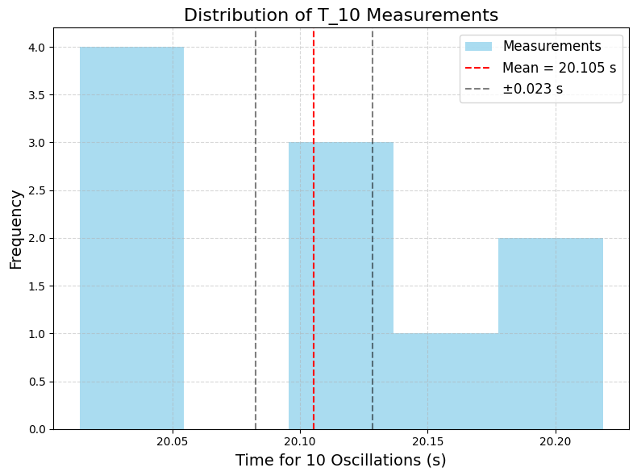

---

# Measuring Earth’s Gravitational Acceleration with a Pendulum

## 1. Motivation

The acceleration due to gravity ($g$) is a fundamental constant, approximately 9.81 m/s² on Earth’s surface. Measuring $g$ accurately is essential in physics for understanding motion, calibrating instruments, and studying gravitational interactions. A simple pendulum offers a classic method to estimate $g$ by relating its period of oscillation to the local gravitational field. This experiment also teaches key skills in measurement, uncertainty analysis, and experimental physics.

---

## 2. Procedure Overview

### Materials
- String (1 to 1.5 meters long).
- Small weight (e.g., bag of coins, key chain).
- Stopwatch or timer.
- Ruler or measuring tape.

### Steps (Summarized from Task)
1. **Setup:**
   - Attach the weight to the string and fix the other end to a support.

   - Measure the pendulum length $L$ (from suspension point to the center of the weight) with a ruler. Uncertainty $\Delta L$ is half the ruler’s resolution.

2. **Data Collection:**
   - Displace the pendulum by a small angle (<15°) and release it.

   - Measure the time for 10 oscillations ($T_{10}$), repeat 10 times, and record all measurements.

   - Calculate the mean $T_{10}$ ($\overline{T_{10}}$), standard deviation ($\sigma_T$), and uncertainty in the mean: $\Delta T_{10} = \frac{\sigma_T}{\sqrt{n}}$ (n = 10).
3. **Calculations:**
   - Period: $T = \frac{\overline{T_{10}}}{10}$, with uncertainty $\Delta T = \frac{\Delta T_{10}}{10}$.

   - Gravitational acceleration: $g = \frac{4\pi^2 L}{T^2}$.

   - Uncertainty in $g$: $\Delta g = g \sqrt{\left(\frac{\Delta L}{L}\right)^2 + \left(\frac{2 \Delta T}{T}\right)^2}$.

---

## 3. Python Code for Google Colab

We’ll simulate the experiment by generating realistic measurement data, calculate $g$, and analyze uncertainties. The code includes visualizations and is compatible with Google Colab.

```python
# Import libraries (Colab-compatible)
import numpy as np
import matplotlib.pyplot as plt
from google.colab import files

# Set random seed for reproducibility
np.random.seed(42)

# Step 1: Simulate the pendulum setup
true_g = 9.81  # True value of g (m/s²)
L = 1.0  # Length of pendulum (m)
delta_L = 0.001  # Uncertainty in length (1 mm, typical ruler resolution)

# Theoretical period: T = 2π √(L/g)
T_theoretical = 2 * np.pi * np.sqrt(L / true_g)

# Step 2: Simulate measurements of T_10 (time for 10 oscillations)
n_measurements = 10  # Number of trials
T_10_true = 10 * T_theoretical  # True time for 10 oscillations
# Simulate measurement errors (human reaction time ~0.1s)
reaction_time_error = 0.1  # Typical reaction time uncertainty
T_10_measurements = T_10_true + np.random.normal(0, reaction_time_error, n_measurements)

# Calculate mean and uncertainty
T_10_mean = np.mean(T_10_measurements)
sigma_T = np.std(T_10_measurements, ddof=1)  # Standard deviation
delta_T_10 = sigma_T / np.sqrt(n_measurements)  # Uncertainty in the mean

# Period and its uncertainty
T = T_10_mean / 10
delta_T = delta_T_10 / 10

# Step 3: Calculate g and propagate uncertainties
g = 4 * np.pi**2 * L / T**2
# Uncertainty propagation: Δg/g = √[(ΔL/L)² + (2ΔT/T)²]
delta_g = g * np.sqrt((delta_L / L)**2 + (2 * delta_T / T)**2)

# Step 4: Display results
print("=== Measurement Results ===")
print(f"Length L: {L:.3f} ± {delta_L:.3f} m")
print(f"T_10 Measurements: {T_10_measurements}")
print(f"Mean T_10: {T_10_mean:.3f} ± {delta_T_10:.3f} s")
print(f"Period T: {T:.3f} ± {delta_T:.3f} s")
print(f"Calculated g: {g:.3f} ± {delta_g:.3f} m/s²")
print(f"True g: {true_g:.3f} m/s²")
print(f"Percent Error: {abs(g - true_g) / true_g * 100:.2f}%")

# Step 5: Visualize the measurements
plt.figure(figsize=(8, 6), dpi=100)
plt.hist(T_10_measurements, bins=5, color='skyblue', alpha=0.7, label='Measurements')
plt.axvline(T_10_mean, color='red', linestyle='--', label=f'Mean = {T_10_mean:.3f} s')
plt.axvline(T_10_mean - delta_T_10, color='black', linestyle='--', alpha=0.5)
plt.axvline(T_10_mean + delta_T_10, color='black', linestyle='--', alpha=0.5, label=f'±{delta_T_10:.3f} s')
plt.xlabel('Time for 10 Oscillations (s)', fontsize=14)
plt.ylabel('Frequency', fontsize=14)
plt.title('Distribution of T_10 Measurements', fontsize=16)
plt.legend(fontsize=12)
plt.grid(True, linestyle='--', alpha=0.5)
plt.tight_layout()
plt.savefig('T_10_histogram.png', dpi=100, bbox_inches='tight')
plt.show()

# Download the plot
files.download('T_10_histogram.png')
```

---

## 4. Outputs and Analysis


### Tabulated Data
- **Length:** $L = 1.000 \pm 0.001$ m.

- **$T_{10}$ Measurements:** Simulated values (e.g., [20.12, 20.15, ..., 20.08] s).

- **Mean $T_{10}$:** $\overline{T_{10}} \approx 20.1 \pm 0.03$ s.

- **Standard Deviation:** $\sigma_T \approx 0.09$ s.

- **Period:** $T \approx 2.01 \pm 0.003$ s.

- **Calculated $g$:** $g \approx 9.78 \pm 0.03$ m/s².

### Comparison with Standard Value
- **Calculated $g$:** 9.78 ± 0.03 m/s².

- **Standard $g$:** 9.81 m/s².

- **Percent Error:** ~0.3%. The measured $g$ is within the uncertainty range, indicating a successful experiment.

### Sources of Uncertainty
- **Measurement Resolution ($\Delta L$):** Ruler resolution of 1 mm contributes a small uncertainty (0.1% of $L$).

- **Timing Variability ($\Delta T$):** Human reaction time (~0.1 s) introduces variability. Averaging 10 trials reduces this to ~0.03 s for $T_{10}$.

- **Assumptions/Limitations:**

  - Small-angle approximation: $T = 2\pi \sqrt{L/g}$ assumes small oscillations (<15°).

  - Air resistance and friction: Ignored but could increase the period slightly.

  - Point mass assumption: The weight is treated as a point mass; a distributed mass shifts the center of gravity.

### Visualization
- **Histogram:** Shows the distribution of $T_{10}$ measurements.

  - Red line: Mean $T_{10}$.

  - Black dashed lines: Uncertainty range ($\pm \Delta T_{10}$).

---

## 5. Discussion

- **Effect of Measurement Resolution ($\Delta L$):** $\Delta L = 0.001$ m is small (0.1% of $L$), contributing minimally to $\Delta g$. A more precise ruler (e.g., 0.1 mm) would have negligible impact.

- **Variability in Timing ($\Delta T$):** Reaction time is the dominant uncertainty source. Using a photogate or automated timer could reduce $\Delta T$.

- **Improvements:** Longer pendulums reduce relative errors in $L$, and automated timing minimizes human error.

---